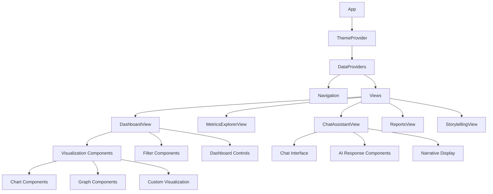
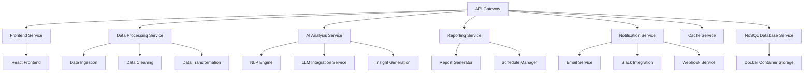
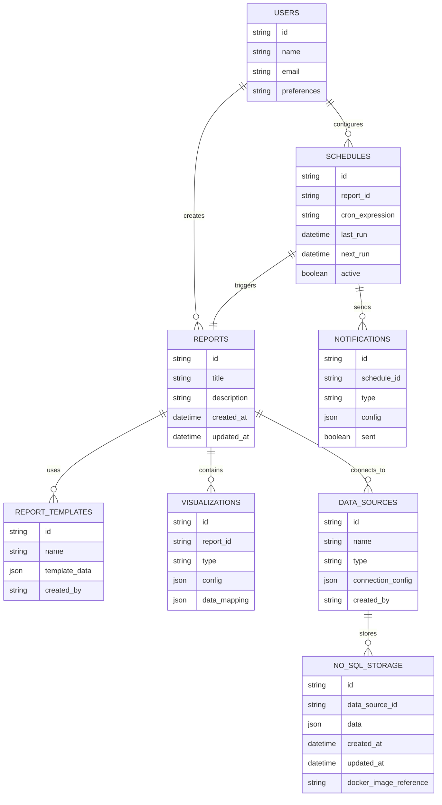

# Project Analysis Report: Vibe-UI Data Analysis Tool

## 1. Overview

The current project is a React frontend application with a Python Flask backend that generates random data for visualization. The application currently has three main views:

1. Dashboard View - Displays data in charts and tables
2. Metrics Explorer - Allows users to explore metrics with filtering capabilities
3. Chat Assistant - Basic chat interface that can display data

The goal is to transform this application into an AI-powered data analysis tool with storytelling capabilities, advanced charting, and scheduled reporting features. The current architecture has a clear separation between UI (which handles visualization) and backend (which provides data processing capabilities), making it well-suited for enhancement with LLM integration.

## 2. Current Architecture

### 2.1 Frontend Architecture (React/TypeScript)

#### Technology Stack
- React 19.x with TypeScript
- Chart.js for data visualization
- CSS Modules for styling
- Vite as the build tool
- Context API for state management
- shadcn/ui components for enhanced UI elements
- Tailwind CSS for utility-first styling
- Radix UI for accessible component primitives

#### Component Structure
- **App Component**: Main application component handling tab navigation
- **Views**:
  - DashboardView: Main data visualization interface
  - MetricsExplorerView: Advanced metrics exploration
  - ChatView: Chat interface for data interaction
- **Core Components**:
  - GenericGraph: Charting component using Chart.js
  - DataTable: Data display with filtering capabilities
  - GraphFilterColumn: Filtering controls for graphs
  - TabNavigation: Navigation between views
  - ThemeToggle: Dark/light mode toggle
- **Context Providers**:
  - DataContext: Manages data fetching and processing
  - ChatContext: Handles chat functionality
  - MetricsContext: Manages metrics-related state
  - ThemeContext: Handles theme switching

#### Data Flow
1. DataContext fetches data from backend API
2. Data is processed and made available to components via context
3. Components consume processed data for visualization
4. User interactions update context state, triggering re-renders

### 2.2 Backend Architecture (Python Flask)

#### Technology Stack
- Flask web framework
- Flask-CORS for cross-origin requests
- Random data generation for simulation

#### API Endpoints
- `/api/data`: Returns randomly generated datasets

#### Data Generation
The backend currently generates several types of random datasets:
1. Sales/Finance/Tech data with categories, regions, and values
2. Banking transaction data with transaction types and amounts
3. HR/recruitment data with candidate information
4. Department task data with completion rates

## 3. Transformation Plan

### 3.1 AI-Powered Data Analyst Features

#### Storytelling Engine
- Natural language processing for data insights
- Automated narrative generation based on data patterns
- Contextual explanations of data anomalies
- Trend analysis and forecasting capabilities
- Automated insight generation from data patterns
- Key metric identification and highlighting
- Comparative analysis between datasets
- Root cause analysis for anomalies
- Natural language querying of data
- Automated report generation from data insights

#### Enhanced Visualization
- Advanced charting options (heatmaps, tree maps, sankey diagrams)
- Interactive dashboards with drill-down capabilities
- Custom visualization templates
- Export options for charts and reports
- Real-time data visualization
- Multi-dimensional data representation
- Customizable chart themes and styling
- Animation and transition effects for data changes
- Drag-and-drop dashboard configuration
- Responsive visualization layouts
- Dynamic chart type switching
- Interactive chart annotations
- Multi-chart synchronization
- Custom visualization components
- Real-time chart updates
- Integration with D3.js for complex visualizations
- Recharts library for additional chart types
- Victory charting library for declarative visualizations

#### Intelligent Data Processing
- Automated data cleaning and validation
- Smart data grouping and aggregation
- Anomaly detection algorithms
- Data correlation analysis
- Predictive analytics and forecasting
- Data enrichment from external sources
- Automated data categorization
- Pattern recognition and clustering
- Statistical analysis capabilities
- Data quality assessment tools
- Dynamic data transformation pipelines
- Real-time data processing capabilities
- Column-level data transformations
- Custom aggregation functions
- Data lineage tracking

#### POML (Prompt-Oriented Markup Language) Support
- Standardized format for structuring prompts to LLMs
- Template-based prompt generation for consistent results
- Dynamic prompt construction based on data context
- Prompt versioning and management system
- Prompt testing and optimization framework
- Integration with popular LLM providers (OpenAI, Anthropic, etc.)
- Prompt security and sanitization mechanisms
- Performance monitoring and analytics for prompts
- Multi-model prompt routing based on task type

### 3.2 Scheduled Reporting System

#### Report Configuration
- Drag-and-drop report builder
- Customizable report templates
- Data source configuration
- Visualization selection and customization
- Parameterized reports for dynamic content
- Report chaining and dependencies
- Multi-language report support
- Branding and styling customization

#### Scheduling Engine
- Recurring report generation (daily, weekly, monthly)
- Time-based triggers
- Conditional report generation
- Distribution lists and delivery mechanisms
- Report versioning and history tracking
- Performance monitoring and alerts
- Resource allocation and optimization
- Failure handling and retry mechanisms

#### Notification System
- Email report delivery
- In-app notifications
- Slack/Teams integration
- Custom webhook support
- SMS notifications
- Push notifications for mobile devices
- Notification preferences and opt-out management
- Delivery confirmation and tracking

## 4. Proposed Architecture for AI-Powered Tool

### 4.1 Frontend Enhancements

#### Component Architecture

#### New Components
- **StorytellingView**: Dedicated interface for AI-generated narratives
- **ReportsView**: Report configuration and management
- **AdvancedChart**: Enhanced visualization components
- **NarrativeGenerator**: Component for displaying AI insights
- **ScheduleManager**: Interface for configuring report schedules
- **AIPromptBuilder**: UI for constructing and testing POML prompts
- **InsightDashboard**: Specialized dashboard for AI-generated insights
- **AnomalyDetector**: Visual component for highlighting data anomalies
- **ForecastingView**: Interface for predictive analytics and trend forecasting
- **DataQualityReport**: Component for displaying data validation results
- **DynamicDataTable**: Enhanced data table with advanced filtering and transformation
- **VisualizationFilterPanel**: Interactive filter controls for visualizations
- **DashboardBuilder**: Drag-and-drop dashboard configuration interface
- **DataTransformationEditor**: UI for creating dynamic data transformations
- **RealTimeUpdater**: Component for handling real-time data updates
- **UIComponentLibrary**: Integration of shadcn/ui and Radix UI components
- **DesignSystemProvider**: Centralized theme and styling management
- **ChartingLibrary**: Integration of multiple charting libraries (Recharts, Victory, D3.js)

### 4.2 Backend Enhancements

#### Microservices Architecture

#### New Services
- **AI Analysis Service**: Handles natural language processing and insight generation
- **Reporting Service**: Manages report generation and scheduling
- **Notification Service**: Handles report delivery and user notifications
- **Data Processing Service**: Enhanced data cleaning and transformation capabilities
- **Prompt Management Service**: Manages POML templates and prompt optimization
- **Anomaly Detection Service**: Identifies and analyzes data anomalies
- **Forecasting Service**: Provides predictive analytics and trend analysis
- **Data Quality Service**: Validates and ensures data integrity
- **LLM Integration Service**: Manages connections to various LLM providers (OpenAI, Gemini, Ollama, custom)
- **Cache Service**: Provides intelligent caching for data, visualizations, and LLM responses
- **Visualization Service**: Manages chart rendering and dashboard visualization
- **Data Transformation Service**: Handles dynamic data transformations and aggregations
- **Real-time Data Service**: Manages real-time data updates and streaming
- **UI Component Service**: Manages UI component library integration and styling
- **Design System Service**: Handles theme management and consistent styling
- **NoSQL Database Service**: Manages fast data storage and retrieval
- **Docker Orchestration Service**: Handles containerized service deployment

#### Database Schema

## 5. Implementation Roadmap

### Phase 1: Core AI Analysis Features
- Implement natural language query processing
- Add basic storytelling capabilities
- Enhance charting components with new visualization types
- Create the StorytellingView component
- Implement POML prompt builder UI
- Add data quality assessment features
- Create anomaly detection visualization
- Develop basic forecasting capabilities
- Integrate with OpenAI API for initial LLM capabilities
- Implement basic caching for data responses
- Enhance data tables with advanced filtering and sorting
- Add dynamic data transformation capabilities
- Integrate shadcn/ui components for enhanced UI elements
- Implement Tailwind CSS for modern styling
- Set up Docker containerization for backend services
- Implement NoSQL database for fast data storage

### Phase 2: Reporting System
- Develop report template system
- Implement report generation engine
- Create ReportsView for managing reports
- Add export functionality (PDF, CSV, etc.)
- Implement parameterized report templates
- Add report versioning and history
- Create collaborative report editing features
- Add multi-language report support
- Enhance caching with dashboard layout persistence
- Add support for multiple LLM providers (Gemini, Ollama)
- Implement advanced dashboard filtering capabilities
- Add real-time data update features
- Optimize NoSQL database queries for reporting
- Implement Docker volume management for report storage

### Phase 3: Scheduling and Notifications
- Build scheduling engine with cron-like capabilities
- Implement notification service with multiple delivery channels
- Add UI for configuring report schedules
- Create notification management interface
- Implement conditional report triggering
- Add performance monitoring and alerts
- Create audit trails for report generation
- Add resource allocation optimization
- Implement intelligent cache invalidation strategies
- Add drag-and-drop dashboard configuration
- Implement dashboard templates and sharing
- Add collaborative dashboard editing features
- Implement Docker container orchestration for scheduled tasks
- Optimize NoSQL database for scheduled data processing

### Phase 4: Advanced Features
- Add collaborative features (comments, sharing)
- Implement version control for reports
- Add advanced analytics and forecasting
- Create mobile-responsive interfaces
- Implement real-time dashboard updates
- Add multi-language support
- Create customizable user preferences
- Implement audit trails and compliance features
- Add advanced data correlation analysis
- Create predictive modeling tools
- Implement custom LLM provider integration
- Add real-time collaborative dashboard editing
- Implement cache warming for frequently accessed reports
- Add advanced data visualization interactions
- Implement intelligent dashboard recommendations
- Implement advanced Docker orchestration with Kubernetes
- Add NoSQL database replication and clustering for high availability

## 6. Technical Considerations

### Performance Optimization
- Implement data pagination for large datasets
- Add caching mechanisms for frequently accessed data
- Optimize chart rendering for large datasets
- Use web workers for heavy computational tasks
- Optimize bundle size with tree-shaking for UI libraries
- Implement code splitting for UI components
- Use CSS-in-JS or utility-first CSS for efficient styling

### Caching Strategy
- Implement multi-level caching (browser, API, database)
- Cache LLM responses with intelligent invalidation
- Cache processed data visualizations
- Cache dashboard configurations and layouts
- Implement cache warming for frequently accessed reports
- Add cache performance monitoring and analytics
- Support cache persistence across sessions
- Implement cache size limits and eviction policies
- Cache dynamic data transformations
- Cache filter and grouping operations
- Cache real-time data updates
- Implement intelligent cache invalidation for dependent visualizations

### Security
- Implement authentication and authorization
- Add data encryption for sensitive information
- Validate all user inputs
- Implement rate limiting for API endpoints

### Scalability
- Design microservices architecture for independent scaling
- Use message queues for asynchronous processing
- Implement database connection pooling
- Add load balancing capabilities
- Containerize services with Docker for easy scaling
- Implement NoSQL database sharding for large datasets
- Use Docker volumes for persistent data storage

### UI/UX Improvements for AI-Powered Tool
- Implement intelligent UI personalization based on user behavior
- Add progressive disclosure for complex features
- Create contextual help and onboarding experiences
- Design adaptive layouts for different screen sizes
- Implement voice commands for data queries
- Add gesture-based interactions for data exploration
- Create accessible interfaces for users with disabilities
- Implement dark/light mode with AI-enhanced themes
- Add drag-and-drop dashboard configuration
- Implement real-time collaborative dashboard editing
- Create customizable dashboard templates
- Add dashboard versioning and rollback capabilities
- Implement intelligent data table features
- Add advanced filtering and sorting capabilities
- Create dynamic data transformation tools
- Implement real-time data updates
- Integrate shadcn/ui components for consistent UI elements
- Implement Tailwind CSS for utility-first styling
- Add Radix UI primitives for accessible components
- Create design system with consistent typography and spacing

## 7. Integration Points

### External Services
- Cloud storage for report exports
- Email services for notifications
- Slack/Teams APIs for messaging integration
- Third-party data sources (databases, APIs)

### APIs
- RESTful API for frontend communication
- GraphQL endpoint for flexible data querying
- Webhook endpoints for external integrations
- WebSocket connections for real-time updates

### LLM Provider Integration
- OpenAI API integration for GPT models
- Google Gemini API integration
- Ollama integration for local LLM deployment
- Custom LLM provider adapter framework
- Multi-model routing based on task requirements
- LLM response caching and optimization
- Provider fallback mechanisms for reliability
- Cost monitoring and optimization tools

### Open-Source UI Libraries
- shadcn/ui components for accessible UI elements
- Tailwind CSS for utility-first styling
- Radix UI for accessible component primitives
- Recharts for additional charting capabilities
- D3.js for complex data visualizations
- Victory for declarative charting components

### Docker and NoSQL Integration
- Docker containerization for all services
- Local Docker image storage for data and services
- NoSQL database integration for fast data retrieval
- MongoDB or CouchDB for document-based storage
- Redis for caching and real-time data
- Docker-compose for local development environments
- Container orchestration with Docker Swarm or Kubernetes

## 8. Addressing Data Analysis Gaps

### Current Gaps in Data Analysis Capabilities
- Limited statistical analysis functions
- No predictive modeling capabilities
- Basic data visualization options
- Lack of collaborative analysis features
- No data quality assessment tools
- Limited data transformation capabilities
- Absence of anomaly detection
- No natural language querying

### Addressing the Gaps Through AI Enhancement
- Implement statistical analysis libraries (SciPy, NumPy)
- Add machine learning models for predictive analytics
- Integrate advanced visualization libraries (D3.js, Plotly)
- Create collaborative workspaces for team analysis
- Develop data profiling and quality assessment tools
- Add ETL (Extract, Transform, Load) capabilities
- Implement anomaly detection algorithms
- Integrate natural language processing for queries
- Add dynamic data transformation pipelines
- Implement real-time data visualization updates
- Create intelligent filtering and sorting capabilities
- Add collaborative dashboard editing features

### UI Elements for Enhanced Data Analysis
- Interactive data exploration canvas
- Drag-and-drop analysis workflow builder
- Real-time collaboration indicators
- Data quality scorecards
- Statistical summary panels
- Model performance dashboards
- Data lineage visualization
- Custom function/script editor
- Advanced data tables with sorting and filtering
- Dynamic data transformation controls
- Interactive visualization filters
- Real-time data update indicators
- Column-level data transformations
- Custom aggregation functions
- Data preview and validation tools

## 9. Testing Strategy

### Unit Testing
- Component testing with Jest and React Testing Library
- Service layer testing with pytest
- Utility function testing
- API endpoint testing

### Integration Testing
- End-to-end testing with Cypress
- Data flow testing between services
- UI interaction testing
- Report generation testing

### Performance Testing
- Load testing with large datasets
- Stress testing of API endpoints
- Chart rendering performance
- Database query optimization

## 10. Deployment Considerations

### Infrastructure
- Containerization with Docker
- Orchestration with Kubernetes
- CI/CD pipeline setup
- Monitoring and logging implementation
- Local Docker image storage for all services
- NoSQL database integration for fast data retrieval

### Environment Configuration
- Development, staging, and production environments
- Environment-specific configuration management
- Database migration strategies
- Backup and disaster recovery plans
- Docker-compose configuration for local development
- Containerized NoSQL database deployment